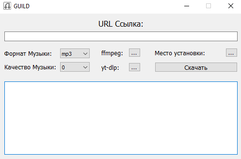
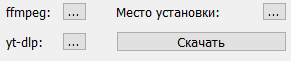
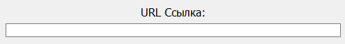

# GUILD
**GUILD** - это простое графическое приложение для скачивания музыки из YouTube и YouTube Music с возможностью выбрать качество и формат аудио.
<div align="center">
    
</div>

Скачивание осуществляется через `yt-dlp`, а конвертация в аудиофайл осуществляется через `ffmpeg`.

## Навигация
- [GUILD](#guild)
  - [Навигация](#навигация)
  - [Установка и запуск](#установка-и-запуск)
    - [1. Подготовка](#1-подготовка)
    - [2. Установка зависимостей](#2-установка-зависимостей)
    - [3. Подготовка необходимых файлов](#3-подготовка-необходимых-файлов)
    - [4. Первый запуск](#4-первый-запуск)
  - [Использование](#использование)
  - [Отказ от ответственности](#отказ-от-ответственности)

## Установка и запуск
### 1. Подготовка
Установите код проекта в удобное для вас место. Для этого нажмите на зеленую кнопку `code` сверху. Далее нажмите на надпись: **Download ZIP**.
<div align="center">
    
</div>

Убедитесь, что у вас установлен Python. Проверить версию можно командой в терминале:
```python
python --version
```
После выполнения команды вы должны увидеть версию языка (Пример: `Python 3.14.4`). Если вы увидели что-то вроде: `не является внутренней или внешней командой`, то установите Python и перезапустите компьютер.
### 2. Установка зависимостей
Откройте терминал в папке с проектом и выполните:
```python
pip install -r requirements.txt
```
### 3. Подготовка необходимых файлов
**GUILD** для работы требует наличие двух внешних программ:

- [yt-dlp.exe](https://github.com/yt-dlp/yt-dlp/releases)
- [ffmpeg.exe](https://github.com/BtbN/FFmpeg-Builds/releases)

Установите их нажав по названиям. После установки расположите их в удобном для вас месте.

Также у вас могут возникнуть проблемы со скачиванием музыки, если вы не скачаете `deno`:

- [deno.exe](https://github.com/denoland/deno/releases)

`deno.exe` должен располагаться в одной папке вместе с `yt-dlp.exe`
### 4. Первый запуск
Запустите программу путем ввода данной команды в терминале находясь в папке проекта:
```python
python main.py
```
## Использование
Перед началом работы программы нужно указать расположение установленных заранее `yt-dlp` и `ffmpeg`, а также место установки аудио. Для этого воспользуйтесь тремя точками напротив обозначений:
<div align="center">
    
</div>
После нужно указать URL ссылку на трек в YouTube или YouTube Music в соответствующем поле:
<div align="center">
    
</div>

После можно нажать на кнопку **Скачать** и подождав некоторое время (Зависит от скорости интернета) получить аудио файл в указанном ранее месте.

**Важно!** Качество музыки (Битрейт) задается числом от 0 до 10, где 0 - наивысшее качество, а 10 - наихудшее качество.

**Крайне Важно!** Вписывая в URL целый плейлист будьте готовы к тому, что программа может зависнуть показывя статус: (*Не отвечает*)

## Отказ от ответственности
**ИСПОЛЬЗОВАНИЕ ПО СОБСТВЕННОМУ РИСКУ**

Автор этого проекта не несет никакой ответственности за последствия использования программы **GUILD**.

- Программа скачивает контент (музыку) с платформ, в частности с **YouTube**, используя инструменты `yt-dlp` и `ffmpeg`.
- Автор не гарантирует, что программа будет работать без ошибок, что она полностью совместима со всеми версиями сервисов **YouTube** или что она не нарушит условия использования *(Terms of Service)* указанных платформ.
- Любые убытки, возникшие в результате использования или некорректной работы программы, остаются на совести пользователя.

**В частности, использование программы может привести к:**
- Ограничению доступа к аккаунту YouTube со стороны сервиса.
- Снижению качества аудиофайлов.
- Юридическим последствиям со стороны правообладателей контента.